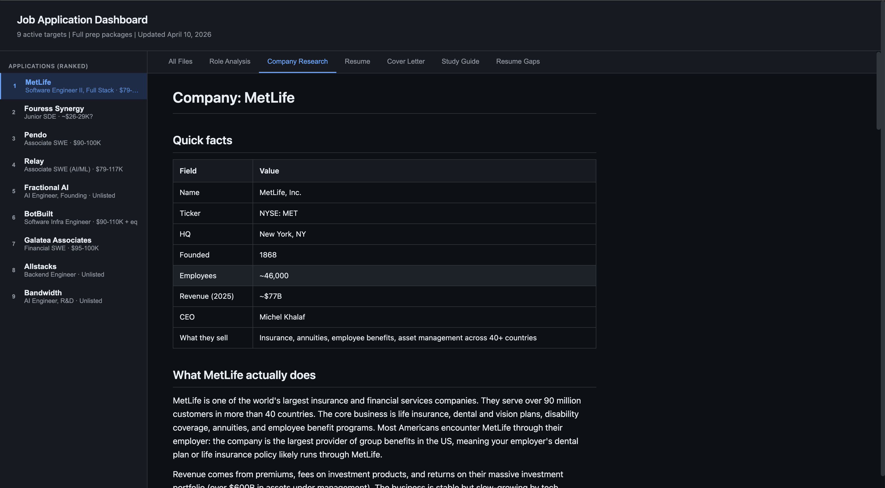

# Job Tracker

This repo is my personal job-search operating system.

I built it to manage a real application pipeline with AI assistance, not just a spreadsheet of links. It keeps track of sourced roles, company research, tailored resumes, cover letters, study guides, and application status in one place so I can run my search with structure instead of chaos.


## What this project actually does

At a high level, the repo does four things:

1. It stores a structured record of job-search activity.
2. It keeps my profile, project history, and writing voice in one source of truth.
3. It generates per-company application packages from that source of truth.
4. It gives me a repeatable pipeline for sourcing, researching, and preparing for roles.

This is not a generic SaaS app and it is not a toy prompt demo.

It is a working system I use day to day to:

- source new jobs from target company career pages
- track application events in append-only JSON
- research companies and roles
- generate tailored resumes and cover letters
- create study guides and prep notes for interviews
- keep outputs truthful by grounding everything in my actual projects and skills

## Why I built it

Most job searches break down because information gets scattered.

Jobs live in one place, notes in another, resumes in another, and every new application turns into manual rewriting. I wanted a setup where:

- my real background only has to be written down once
- every application can pull from that same base
- updates are consistent across roles
- AI helps with speed but does not invent facts

This repo is the result.

## How the system is organized

The repo has three main layers.

### 1. Profile layer

The [`profile/`](/Users/masongalusha/Workspace/job/profile) directory is the core source of truth.

It contains:

- skills and experience I can honestly claim
- project writeups
- career story and positioning
- writing voice rules
- compensation preferences
- target companies

Everything downstream reads from this layer. That means resumes, cover letters, research docs, and interview prep all stay consistent.

### 2. Data layer

The [`data/`](/Users/masongalusha/Workspace/job/data) directory stores structured job-search records.

Important files:

- [`data/events.jsonl`](/Users/masongalusha/Workspace/job/data/events.jsonl): append-only event log for application activity
- [`data/sourced-jobs.jsonl`](/Users/masongalusha/Workspace/job/data/sourced-jobs.jsonl): queue of sourced opportunities
- [`data/applications.json`](/Users/masongalusha/Workspace/job/data/applications.json): derived view of applications
- [`data/communications.json`](/Users/masongalusha/Workspace/job/data/communications.json): derived communication view

I use append-only JSONL because it is easy to inspect, easy to diff, and good for agent-driven workflows where you want a clear audit trail.

### 3. Application artifact layer

The [`applications/`](/Users/masongalusha/Workspace/job/applications) directory contains one folder per target role.

Each role folder can include files like:

- `role.md`
- `company.md`
- `resume.md`
- `cover-letter.md`
- `study-guide.md`
- `resume-gaps.md`

That means each application becomes its own mini dossier instead of a vague to-do item.


Here is the dashboard view of that system in use:



## Example workflow

Here is the basic pipeline this repo supports:

1. Source jobs from target companies and append them to the queue.
2. Review a role and write a structured `role.md`.
3. Research the company and write `company.md` when the role looks strong.
4. Generate a tailored resume and cover letter using the profile docs.
5. Create study guides or outreach drafts when needed.
6. Log what happened so the search stays organized over time.

The result is a system where each role moves through a real workflow instead of living as a browser tab.

## What is custom about it

The interesting part is not just that AI is involved. It is how the repo constrains and organizes AI use.

### Truthfulness constraints

The system is designed so generated materials should only draw from facts already grounded in:

- [`profile/skills.md`](/Users/masongalusha/Workspace/job/profile/skills.md)
- [`profile/projects/`](/Users/masongalusha/Workspace/job/profile/projects)
- [`profile/story.md`](/Users/masongalusha/Workspace/job/profile/story.md)
- related profile docs

That makes it much harder for generated application materials to drift into fake or inflated claims.

### Agent-oriented workflow

The repo is set up to work well with Claude Code skills and parallel agent execution.

Project-local skills live in [`.agents/skills/`](/Users/masongalusha/Workspace/job/.agents/skills) and define repeatable tasks such as:

- sourcing jobs
- role intake
- company research
- resume tailoring
- cover letter generation
- interview prep
- outreach drafting

This lets me treat job search work more like a pipeline with reusable steps than a series of one-off prompts.

### Event-sourced updates

Instead of editing status by hand in random places, the repo has a write gate:

- [`scripts/events/log.ts`](/Users/masongalusha/Workspace/job/scripts/events/log.ts) appends events
- [`scripts/events/derive.ts`](/Users/masongalusha/Workspace/job/scripts/events/derive.ts) rebuilds derived views

That keeps the state cleaner over time and makes changes easier to audit.

## Repo layout

```text
profile/          personal source of truth: skills, story, projects, voice
data/             event logs, sourced jobs queue, derived views
applications/     per-role research and application artifacts
templates/        resume and cover letter base templates
schemas/          shared TypeScript and Zod schemas
scripts/          log/derive scripts and helper scripts
notes/            working research notes and long-form materials
web/              static viewer/dashboard output
.agents/skills/   project-local Claude Code skills
```

## Key files to look at first

If you want to understand the repo quickly, start here:

- [`README.md`](/Users/masongalusha/Workspace/job/README.md)
- [`profile/projects/job-tracker.md`](/Users/masongalusha/Workspace/job/profile/projects/job-tracker.md)
- [`data/sourced-jobs.jsonl`](/Users/masongalusha/Workspace/job/data/sourced-jobs.jsonl)
- [`applications/2026-04-10-bandwidth-ai-engineer-rd/role.md`](/Users/masongalusha/Workspace/job/applications/2026-04-10-bandwidth-ai-engineer-rd/role.md)
- [`applications/2026-04-10-bandwidth-ai-engineer-rd/company.md`](/Users/masongalusha/Workspace/job/applications/2026-04-10-bandwidth-ai-engineer-rd/company.md)
- [`scripts/events/log.ts`](/Users/masongalusha/Workspace/job/scripts/events/log.ts)
- [`scripts/events/derive.ts`](/Users/masongalusha/Workspace/job/scripts/events/derive.ts)

Those show the system from three angles: source data, generated outputs, and the update mechanism.

## Current status

This is an active personal system, not a polished public product.

It is useful because it reflects how I actually work:

- structured data where it matters
- markdown where writing and interpretation matter
- AI used for speed and synthesis
- explicit guardrails around truthfulness and consistency

If you are looking at this from a hiring perspective, the repo is best read as a systems thinking project: a practical pipeline for managing a complex process with repeatable artifacts, constrained generation, and real operational use.
